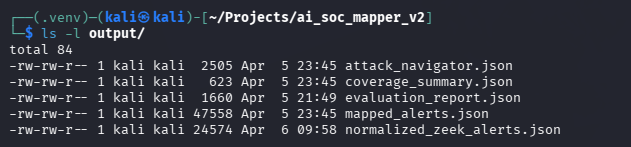
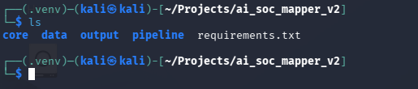
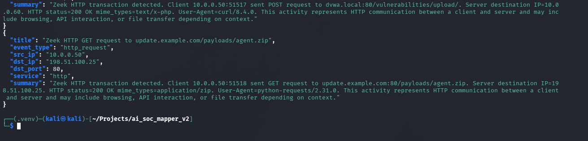

<div align="center">

## 🛡️ AI-Assisted SOC + MITRE ATT&CK Mapping Engine  
### Detection Engineering, ATT&CK Mapping & AI-Assisted Analysis


</div>

---

<div align="center">
  
</div>

<p align="center"><em>Figure 1. Final ATT&CK mapping output showing ranked techniques, confidence, and explainable reasoning.</em></p>

---

## 🧠 Scenario

This project simulates how a **Security Operations Center (SOC)** translates raw telemetry into meaningful threat intelligence.

Rather than relying on static rules, this system demonstrates how detection engineering can combine:

- structured pipelines  
- behavioral logic  
- semantic analysis  
- ATT&CK alignment  

to produce **context-aware, explainable detections**.

---

## 🎯 Objective

The goal of this project was to design a system that moves from:

    Raw Logs (Zeek / Splunk)
    ↓
    Normalized Alerts
    ↓
    ATT&CK Mapping
    ↓
    Analyst-Readable Output

while solving key real-world problems such as:

- inconsistent log formats  
- weak detection context  
- false positives  
- lack of explainability  

---

## 🚨 Detection Problem (Engineering Perspective)

In real SOC environments:

- logs are noisy and inconsistent  
- SIEM data (e.g., Splunk alerts) often lacks deep context  
- rule-based detections are rigid and difficult to scale  
- ATT&CK mapping is frequently manual  

One critical realization during development:

> If the correct ATT&CK technique is not retrieved, no amount of scoring can fix it.

This insight shaped the architecture of the system.

---

## 🖥️ Environment

| Tool | Purpose |
|---|---|
| Python | Pipeline + mapping engine |
| Zeek | Network telemetry |
| Splunk | SIEM-style alert source |
| Sentence Transformers | Semantic similarity |
| TF-IDF | Retrieval layer |
| MITRE ATT&CK | Technique mapping |

---

# ⚙️ Step 1 — System Structure & Pipeline Design

<div align="center">
  
</div>

<p align="center"><em>Figure 2. Project structure showing separation between ingestion, normalization, and mapping layers.</em></p>

The system was designed as a modular pipeline:

- ingestion layer (Zeek + Splunk adapters)  
- normalization layer  
- mapping engine  

This separation allowed each component to be tested and debugged independently.

---

# 📚 Step 2 — ATT&CK Data Preparation

<div align="center">
  
</div>

<p align="center"><em>Figure 3. MITRE ATT&CK data prepared as a searchable corpus.</em></p>

ATT&CK data was transformed into a structured dataset to support:

- retrieval  
- semantic comparison  
- scoring  

---

# 🔍 Step 3 — Candidate Retrieval (TF-IDF)

<div align="center">
  
</div>

<p align="center"><em>Figure 4. TF-IDF retrieval used to generate initial ATT&CK technique candidates.</em></p>

TF-IDF was used to narrow down possible techniques.

At this stage, an important limitation appeared:

- relevant techniques were sometimes not retrieved  
- SIEM-style alerts (Splunk) often lacked enough keywords for accurate matching  

---

# 🧠 Step 4 — Hybrid Scoring Engine

<div align="center">
  
</div>

<p align="center"><em>Figure 5. Hybrid scoring engine combining multiple detection signals.</em></p>

To improve accuracy, a multi-layer scoring system was introduced:

- keyword relevance (TF-IDF)  
- semantic similarity (embeddings)  
- rule-based logic  
- behavior-based overrides  

This allowed the system to approximate how an analyst evaluates alerts.

---

# 🌐 Step 5 — Multi-Source Ingestion (Zeek + Splunk)

<div align="center">
  
</div>

<p align="center"><em>Figure 6. Successful ingestion of Zeek logs into the pipeline.</em></p>

The pipeline was extended to support multiple telemetry sources:

### Zeek (Network Telemetry)
- connection logs (`conn.log`)  
- HTTP logs (`http.log`)  

### Splunk-Style Alerts
- normalized SIEM detections  
- structured alert fields (source, destination, event context)  

Key challenges included:

- parsing inconsistencies  
- aligning different schemas  
- ensuring both sources map to the same normalized format  

---

# 🔄 Step 6 — Normalization Pipeline

<div align="center">
  
</div>

<p align="center"><em>Figure 7. Normalized alert output ensuring consistent structure across data sources.</em></p>

All telemetry was transformed into a unified schema.

This step is critical because:

> Without normalization, cross-source analysis and correlation are unreliable.

---

# ⚙️ Step 7 — ATT&CK Mapping Execution

<div align="center">
  
</div>

<p align="center"><em>Figure 8. Generated ATT&CK mappings with ranked techniques and explanations.</em></p>

The pipeline produces:

- ranked ATT&CK techniques  
- confidence scores  
- explanation of mapping logic  

---

# 🧪 Step 8 — Detection Validation

## 🔹 Web Shell Detection

<div align="center">
  
</div>

<p align="center"><em>Figure 9. Upload behavior correctly mapped to T1505.003 (Web Shell).</em></p>

The system correctly identifies:

- malicious upload behavior  
- server-side execution indicators  

---

## 🔹 Payload Transfer Detection

Behavior-aware logic ensures:

- `T1105 — Ingress Tool Transfer` is included  
- even when retrieval alone is insufficient  

---

## 🔹 False Positive Reduction

Key improvements:

- login traffic is not misclassified as web shell  
- generic HTTP activity does not dominate results  

---

# 🧠 Key Engineering Insights

### Retrieval vs Scoring

The most important lesson:

> Retrieval determines what is possible — scoring determines what is likely.

---

### False Positives Matter More Than Accuracy

Reducing incorrect classifications had a greater impact than improving ranking precision.

---

### Real Systems Require Iteration

This project involved:

- pipeline debugging  
- schema mismatches  
- ingestion issues (Zeek + Splunk)  
- environment troubleshooting  

All of which reflect real-world engineering challenges.

---

# ⚙️ How to Use This Project

### 1. Ingest Logs

```bash
python -m pipeline.ingest_logs --source zeek --path data/sample/
```

### 2. Run Analysis

```bash
python -m pipeline.analyze_alerts --input output/normalized_zeek_alerts.json
```

### 3. Review Output

- ATT&CK technique mappings  
- confidence scores  
- explanation of results  

---

## 💡 What This Project Demonstrates

- detection engineering workflows  
- ATT&CK mapping logic  
- SOC-style triage pipelines  
- AI-assisted analysis techniques  
- multi-source ingestion (Zeek + Splunk)  
- real-world debugging and iteration  

---

# 💼 SOC Relevance

This system simulates:

- SIEM-driven alert analysis (Splunk)  
- network telemetry analysis (Zeek)  
- ATT&CK classification  
- analyst reasoning workflows  

It can be extended into:

- SOAR playbooks  
- automated response systems  
- AI-driven SOC tooling  

---

# 🚧 Future Work

- AI-SOAR response engine  
- threat intelligence enrichment  
- SIEM/XDR API integration  
- detection benchmarking  

---

<div align="center">

## 👤 Shannon Smith  

Cybersecurity | Detection Engineering • SOC Operations • AI-Assisted Security  

🧠 Structured analysis  
🔍 Engineering-driven detection  
🛡️ Real-world SOC simulation  

</div>
