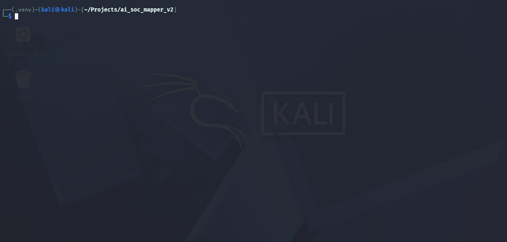
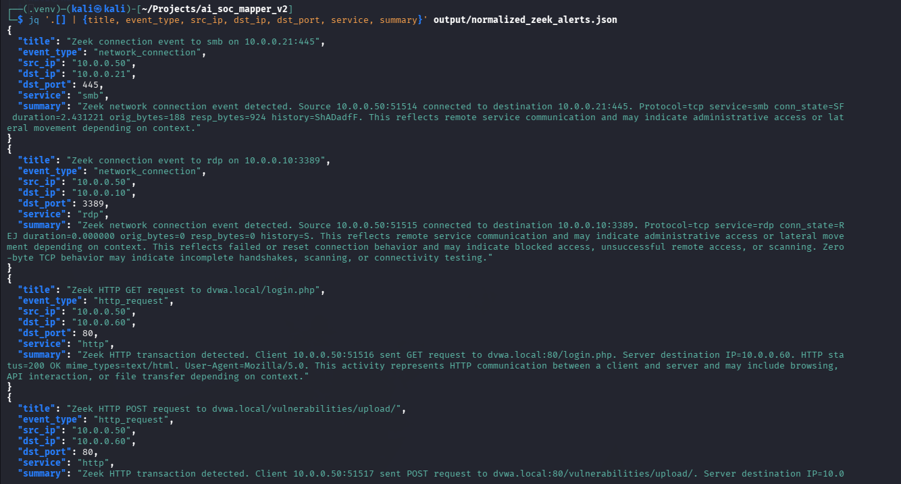

<div align="center">

# 🛡️ ATT&CK Mapping Engine  

## 🧠 SOC Systems • Detection Engineering • Agentic Investigation


</div>

<div align="center">
  
</div>

<p align="center"><em>Detection pipeline demonstrating ingestion → normalization → ATT&CK classification.</em></p>

---

## 🧠 Purpose

This project represents the **detection engineering stage** of an evolving SOC system.

| Stage | Description |
|------|------------|
| Alert Analysis | Understanding and triaging security events |
| Detection Engineering | Mapping behavior to MITRE ATT&CK |
| Investigation | Correlating and enriching alerts |
| Decision Support | Recommending response actions |

---

## 🎯 Objective

The goal of this phase is to demonstrate:

- how raw telemetry is transformed into structured alerts  
- how behavior maps to MITRE ATT&CK techniques  
- how detection pipelines improve classification accuracy  
- how scoring and ranking influence detection quality  
- how structured detection supports downstream investigation  

---

## 🛡️ Phase 2 — ATT&CK Mapping Engine


| Category | Details |
|---------|--------|
| Focus | Classification and structured detection |
| Role | Detection engineering pipeline |
| Output | Ranked ATT&CK techniques |

---

## 🧩 Key Capabilities

- normalization pipeline  
- candidate retrieval (TF-IDF)  
- embedding-based reranking  
- hybrid scoring engine  
- ATT&CK technique ranking  
- explainable detection outputs   

---

## 🧠 Detection Workflow

| Stage | Description |
|------|------------|
| 🟦 Raw Logs | Ingestion from Zeek / SIEM |
| 🟨 Normalization | Structured alert creation |
| 🧠 Candidate Retrieval | TF-IDF technique selection |
| 🧬 Semantic Reranking | Embedding similarity |
| ⚙️ Scoring Engine | Behavior-based weighting |
| 🎯 ATT&CK Mapping | Final classification |
| 📊 Output | Ranked techniques + coverage |

---

## ⚡ Quick Start (Run the Project)

Run the detection pipeline locally using the included sample Zeek data.

### 1. Clone the repository

```bash
git clone https://github.com/shannonasmith/AI-Assisted-SOC-MITRE-ATTACK-Mapping-Engine.git
cd AI-Assisted-SOC-MITRE-ATTACK-Mapping-Engine
```

---

### 2. Create and activate a virtual environment

```bash
python3 -m venv venv
source venv/bin/activate
```

---

### 3. Install dependencies

```bash
pip install --upgrade pip
pip install -r requirements.txt
```

---

### 4. Download MITRE ATT&CK dataset

```bash
mkdir -p data/raw
curl -L "https://raw.githubusercontent.com/mitre/cti/master/enterprise-attack/enterprise-attack.json" -o data/raw/enterprise-attack.json
```

---

### 5. Ingest sample Zeek logs

```bash
python -m pipeline.ingest_logs --source zeek --path data/zeek/
```

---

### 6. Run analysis

```bash
python -m pipeline.analyze_alerts --input output/normalized_zeek_alerts.json
```

---

### 📁 Expected Output

```text
output/mapped_alerts.json
output/coverage_summary.json
output/attack_navigator.json
```

---

## 👀 What This Looks Like in Practice

This walkthrough demonstrates how raw telemetry is transformed into structured ATT&CK-aligned detections through layered processing and scoring.

---

### 🌐 Step 1 — Multi-Source Ingestion

<div align="center">
  
</div>

### 📥 Input

- raw telemetry is collected from Zeek or SIEM sources  
- logs are prepared for downstream processing  

---

### 🔄 Step 2 — Normalization Pipeline

<div align="center">
  
</div>

### ⚙️ Transformation

- logs are converted into structured alert formats  
- key fields (IP, ports, timestamps) are extracted 

---

### 🔍 Step 3 — Candidate Retrieval (TF-IDF)

<div align="center">
  
</div>

### 🧠 Observations

- candidate ATT&CK techniques are identified via TF-IDF  
- prioritizes coverage over precision

---

### 🧠 Step 4 — Behavior-Based Scoring Engine

<div align="center">
  
</div>

### ⚖️ Decision Logic

- scoring adjusts confidence using behavioral rules  
- hybrid approach improves detection accuracy  

---

### ⚙️ Step 5 — ATT&CK Mapping Output

<div align="center">
  
</div>

### 📊 Output

- ranked ATT&CK techniques  
- confidence scores  
- explainable detection results  

---

## ⚙️ Technical Pipeline (Under the Hood)

```text
Raw Logs
    ↓
Normalization
    ↓
Triage Scoring
    ↓
TF-IDF Retrieval
    ↓
Embedding Reranking
    ↓
Hybrid Scoring
    ↓
ATT&CK Mapping
    ↓
Output Generation
```

---

## 💡 What This Project Demonstrates

- detection engineering workflows  
- ATT&CK mapping logic  
- scoring and ranking systems  
- SOC-style classification pipelines  
- AI-assisted analysis techniques  

---

## 💼 SOC Relevance

Simulates:

- SIEM alert triage  
- ATT&CK classification  
- detection engineering pipelines  
- analyst-facing outputs  

---

## 🧬 Project Progression

This project is part of a **multi-phase SOC system**:

[SOC Alert Analyzer](https://github.com/shannonasmith/AI-Assisted-SOC-Alert-Analyzer) → **ATT&CK Mapping Engine (current)** → [Agentic SOC Investigation Engine](https://github.com/shannonasmith/Agentic-SOC-Investigation-Engine) 

---

## 🚧 Future Work

- integration with investigation engine (Phase 3)  
- improved scoring logic  
- threat intelligence enrichment  
- real-time detection pipelines  

---

<div align="center">

## 👤 Shannon Smith  

Cybersecurity | Detection Engineering • SOC Operations • AI-Assisted Security  

</div>
