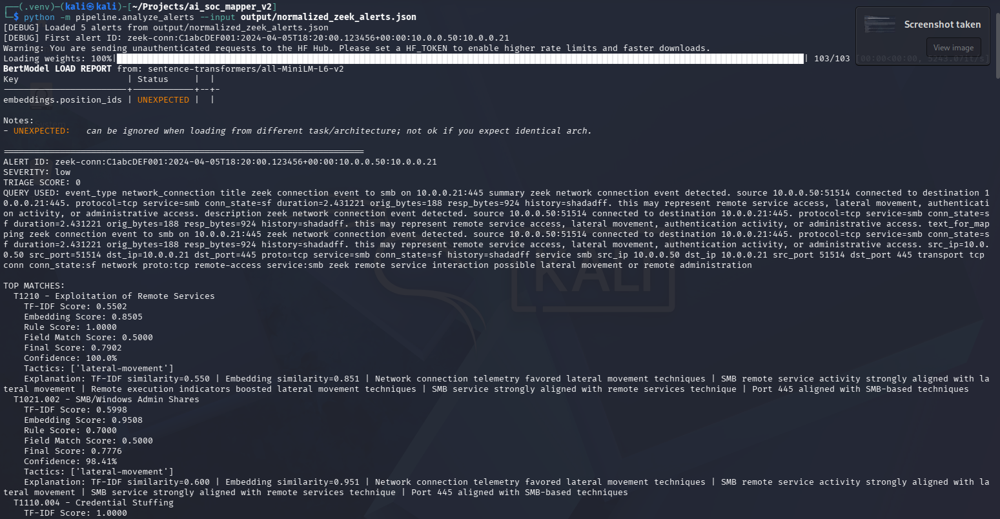
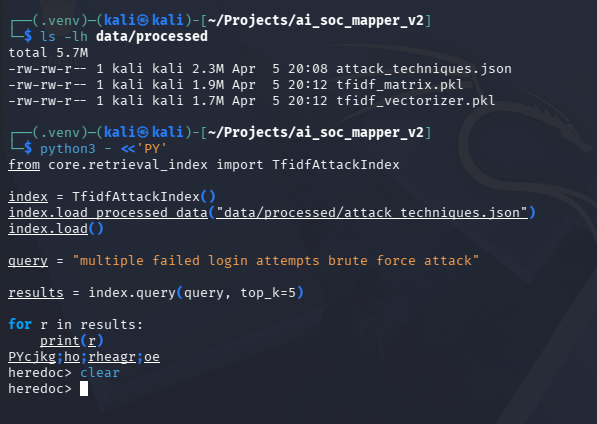
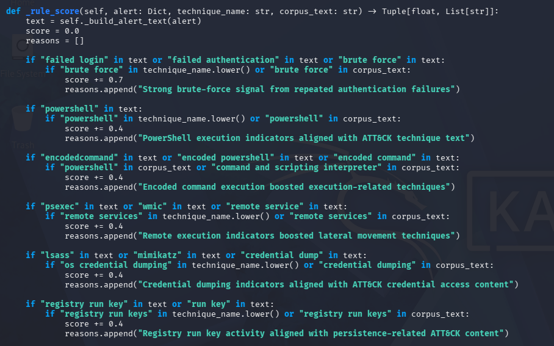

<div align="center">

## 🛡️ AI-Assisted SOC + MITRE ATT&CK Mapping Engine  
### Detection Engineering, ATT&CK Mapping & AI-Assisted Analysis


</div>

<div align="center">
  
</div>

<p align="center"><em>Figure 1. End-to-end pipeline demonstration: ingestion → normalization → ATT&CK mapping.</em></p>

---

## 🧠 Scenario

This project simulates how a **Security Operations Center (SOC)** translates raw telemetry into meaningful threat intelligence.

Rather than relying on static rules, this system demonstrates how detection engineering can combine:

- structured pipelines  
- behavioral logic  
- semantic analysis  
- ATT&CK alignment  

to produce **context-aware, explainable detections**.

---

## 🎯 Objective

The system transforms:

```text
Raw Logs (Zeek / Splunk)
    ↓
Normalized Alerts
    ↓
ATT&CK Mapping
    ↓
Analyst-Readable Output
```

---

## ⚡ Quick Start (Run the Project)

These steps allow you to run the project immediately after downloading.

### 1. Open the project folder

```bash
cd ~/AI-Assisted-SOC-MITRE-ATTACK-Mapping-Engine-main
```

---

### 2. Create and activate a virtual environment

```bash
python3 -m venv venv
source venv/bin/activate
```

---

### 3. Install dependencies

```bash
pip install --upgrade pip
pip install numpy scikit-learn sentence-transformers joblib python-dateutil
```

---

### 4. Download required MITRE ATT&CK data

```bash
mkdir -p data/raw
curl -L "https://raw.githubusercontent.com/mitre/cti/master/enterprise-attack/enterprise-attack.json" -o data/raw/enterprise-attack.json
```

---

### 5. Ingest logs

```bash
python -m pipeline.ingest_logs --source zeek --path data/zeek/
```

---

### 6. Run analysis

```bash
python -m pipeline.analyze_alerts --input output/normalized_zeek_alerts.json
```

---

### 7. Review outputs

```text
output/mapped_alerts.json
output/coverage_summary.json
output/attack_navigator.json
```

---

## 👀 What Happens When You Run This

After running the pipeline, you will see:

- normalized alerts generated from raw logs  
- ATT&CK technique mappings for each alert  
- coverage summaries and Navigator output  

---

## 🔍 How the System Works (Under the Hood)

The following sections show how the system was designed and how each stage of the detection pipeline operates internally.

---

## 🧠 Detection Pipeline Overview

```text
Raw Logs (Zeek / Splunk)
        ↓
Normalization
        ↓
Triage Scoring
        ↓
TF-IDF Candidate Retrieval
        ↓
Embedding-Based Reranking
        ↓
Score Fusion (Hybrid Scoring Engine)
        ↓
ATT&CK Technique Mapping
        ↓
Response Recommendations
        ↓
Coverage Reporting (Navigator Export)
```

---

## 🌐 Step 1 — Multi-Source Ingestion

<div align="center">
  
</div>

<p align="center"><em>Zeek logs successfully ingested into the pipeline.</em></p>

---

## 🔄 Step 2 — Normalization Pipeline

<div align="center">
  
</div>

<p align="center"><em>Example normalized alerts generated from Zeek logs.</em></p>

---

## 🔍 Step 3 — Candidate Retrieval (TF-IDF)

<div align="center">
  
</div>

---

## 🧠 Step 4 — Hybrid Scoring Engine

<div align="center">
  
</div>

---

## ⚙️ Step 5 — ATT&CK Mapping Execution

<div align="center">
  
</div>

<p align="center"><em>Final ATT&CK mapping output with scoring, confidence, and explanations.</em></p>

---

## 🧪 Detection Validation

### 🔹 Web Shell Detection
- correctly identified through HTTP behavior patterns  

### 🔹 Payload Transfer Detection
- `T1105 — Ingress Tool Transfer` successfully mapped  

### 🔹 False Positive Reduction
- benign traffic filtered out  
- login activity not misclassified  

---

## 🧠 Key Engineering Insights

### Retrieval vs Scoring

> Retrieval determines what is possible — scoring determines what is likely.

### False Positives Matter More Than Accuracy

Reducing incorrect classifications had a greater impact than improving ranking precision.

---

## 💡 What This Project Demonstrates

- detection engineering workflows  
- ATT&CK mapping logic  
- SOC-style triage pipelines  
- AI-assisted analysis techniques  
- multi-source ingestion  

---

## 💼 SOC Relevance

This system simulates:

- SIEM-driven alert analysis (Splunk)  
- network telemetry analysis (Zeek)  
- ATT&CK classification  
- analyst reasoning workflows  

---

## 🧠 Operational Output

- triage scoring for alerts  
- recommended response actions  
- coverage summaries  
- ATT&CK Navigator layers  

---

## 🚧 Future Work

- AI-SOAR response engine  
- threat intelligence enrichment  
- SIEM/XDR integration  

---

<div align="center">

## 👤 Shannon Smith  

Cybersecurity | Detection Engineering • SOC Operations • AI-Assisted Security  

</div>
